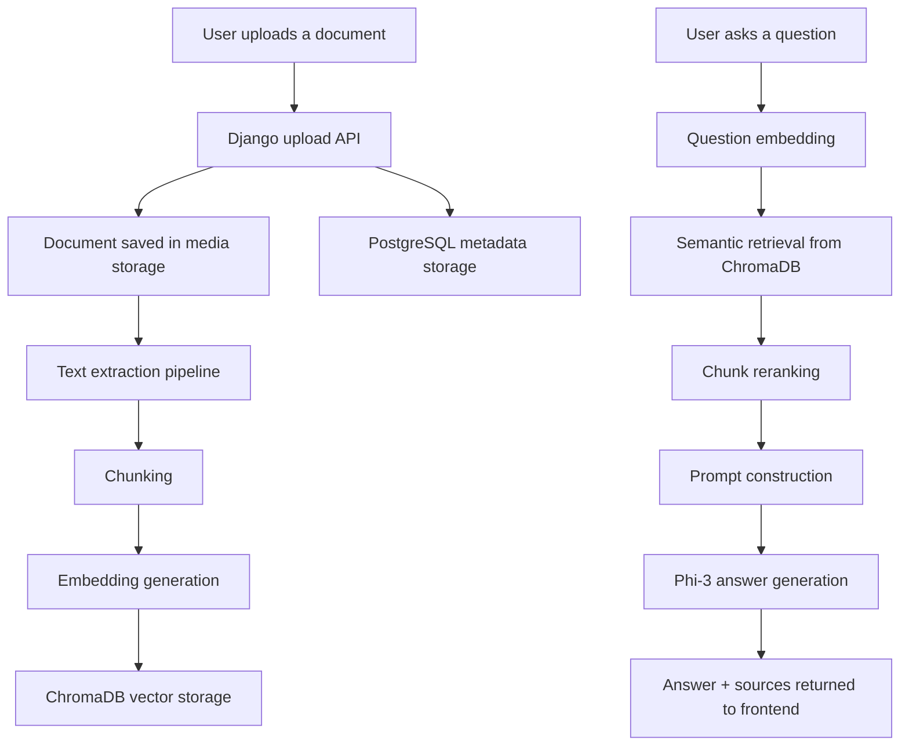

# modelsForDoc

`modelsForDoc` is a full-stack Retrieval-Augmented Generation (RAG) application that lets a user upload documents, index their contents, and ask natural-language questions grounded in those documents.

The project combines:
- a `Django + Django REST Framework` backend
- `PostgreSQL` for document metadata and query history
- `ChromaDB` for vector storage and semantic retrieval
- `Ollama` for both embeddings and answer generation
- a `React + Vite + TailwindCSS` frontend for upload, browsing, chat, and settings

This README is intentionally detailed so it can also serve as base material for a project report, presentation, viva, or internship documentation.

---

## 1. Project Summary

### 1.1 Problem Statement
Many useful files such as PDFs, DOCX files, scanned images, receipts, logs, reports, and spreadsheets contain important information, but that information is hard to query directly. Traditional search is often limited to keyword matching and does not understand meaning or context.

### 1.2 Proposed Solution
`modelsForDoc` solves this problem by building a local document intelligence pipeline:

1. A document is uploaded.
2. Text is extracted from the file.
3. The extracted text is split into chunks.
4. Each chunk is embedded into vector form.
5. The vectors are stored in a vector database.
6. When the user asks a question, the question is embedded.
7. Relevant chunks are retrieved from the vector database.
8. A local LLM generates a grounded answer using the retrieved context.

### 1.3 Main Goal
The goal of the project is to answer document-based questions accurately, briefly, and with relevant context, while running locally through Ollama-based models.

---

## 2. Key Features

- Upload support for `PDF`, `DOCX`, `PPT/PPTX`, `CSV`, image files, and plain text.
- Hybrid text extraction using native parsing plus OCR fallback.
- Configurable chunk size during upload.
- Semantic retrieval using `nomic-embed-text`.
- Answer generation using `phi3:mini`.
- Source previews returned with answers.
- Document-specific querying and automatic document-name inference from user questions.
- Reindex support for older or missing chunk data.
- Modern light-themed frontend with animated backgrounds and chat workflow.

---

## 3. Technology Stack

## 3.1 Backend
- `Python`
- `Django`
- `Django REST Framework`
- `PostgreSQL`
- `ChromaDB`
- `Ollama`

## 3.2 Frontend
- `React`
- `Vite`
- `TailwindCSS`
- `Framer Motion`
- `Axios`
- `React Markdown`
- `React Dropzone`

## 3.3 Extraction and AI Utilities
- `pdfplumber`
- `EasyOCR`
- `pdf2image`
- `python-docx`
- `python-pptx`
- `pandas`
- `langchain-text-splitters`

---

## 4. High-Level Architecture



---

## 5. Project Structure

```text
modelsForDoc/
|-- DocumentApp/
|   |-- chunker.py
|   |-- extractors.py
|   |-- ingest_pipeline.py
|   |-- models.py
|   |-- ollama_embedding.py
|   |-- ollama_llm.py
|   |-- serializers.py
|   |-- urls.py
|   `-- views.py
|-- frontend/
|   |-- src/
|   |   |-- components/
|   |   |-- context/
|   |   |-- pages/
|   |   |-- services/
|   |   |-- App.jsx
|   |   |-- index.css
|   |   `-- main.jsx
|   |-- public/
|   `-- package.json
|-- media/
|-- chroma_db/
|-- modelsForDoc/
|   |-- settings.py
|   |-- urls.py
|   |-- asgi.py
|   `-- wsgi.py
|-- manage.py
`-- README.md
```

---

## 6. Backend Design

## 6.1 Data Models

The backend stores relational metadata in PostgreSQL and semantic vectors in ChromaDB.

### `Document`
Stores:
- uploaded file path
- filename
- file type
- upload timestamp
- extracted full text
- metadata such as extraction information and chunk size

### `Chunk`
Stores:
- parent document
- chunk index
- chunk text
- ChromaDB vector ID
- creation timestamp

### `QueryHistory`
Stores:
- user query text
- time of query
- top matched document IDs
- generated answer

---

## 6.2 File Upload and Ingestion Flow

The upload pipeline is handled by `DocumentUploadView` and `ingest_document()`.

### Flow
1. The frontend sends a file to `/api/upload-doc/`.
2. Django stores the file in `media/documents/`.
3. A `Document` row is created in PostgreSQL.
4. The system extracts text from the file.
5. The extracted text is saved back into PostgreSQL.
6. The text is chunked.
7. Chunks are embedded using Ollama.
8. Vectors are stored in ChromaDB.
9. `Chunk` rows are created in PostgreSQL.

### Important Detail
The current frontend also sends the selected `chunk_size`, so newly uploaded documents are chunked according to the user's settings.

---

## 6.3 Text Extraction Strategy

Text extraction is implemented in [DocumentApp/extractors.py](DocumentApp/extractors.py).

### Supported Extraction Paths

#### PDF
- First tries native text extraction using `pdfplumber`
- Also tries table extraction
- If native text is empty, falls back to OCR using `pdf2image + EasyOCR`

#### DOCX
- Extracts non-empty paragraphs using `python-docx`

#### PPT/PPTX
- Extracts visible text from shapes using `python-pptx`

#### CSV
- Loads the CSV using `pandas`
- Converts it into a text table representation

#### Images
- Uses `EasyOCR`

#### Plain Text / Other
- Reads as plain UTF-8 text with ignore-errors fallback

### Why Hybrid Extraction Matters
Some PDFs contain selectable text, while others are scanned images. A robust document system must support both kinds. This project addresses that through a native-parser-first, OCR-second pipeline.

---

## 6.4 Chunking Strategy

Chunking is implemented in [DocumentApp/chunker.py](DocumentApp/chunker.py).

### Current Behavior
- Default chunk size: `800`
- Allowed chunk size range: `200` to `2000`
- Overlap is computed dynamically:
  - minimum `50`
  - up to `chunk_size // 5`
  - capped at `200`

### Why Chunking Is Needed
LLMs and vector databases work better when large documents are split into smaller semantically meaningful units. Chunking improves retrieval precision and reduces irrelevant context.

### Why Overlap Is Used
Overlap helps preserve continuity between chunks so that important sentences are not broken in a way that harms retrieval.

---

## 6.5 Embedding Layer

Embeddings are implemented in [DocumentApp/ollama_embedding.py](DocumentApp/ollama_embedding.py).

### Embedding Model
- `nomic-embed-text`

### Role
This model converts:
- document chunks into vectors during ingestion
- user questions into vectors during querying

Those vectors are compared in ChromaDB to retrieve semantically similar content.

---

## 6.6 Retrieval and Answer Generation

The main query flow is implemented in [DocumentApp/views.py](DocumentApp/views.py) and [DocumentApp/ollama_llm.py](DocumentApp/ollama_llm.py).

### Query Flow
1. User submits a question to `/api/ask-question/`
2. The backend optionally infers a target document from the question text
3. The backend ensures the selected or inferred document is indexed
4. The question is embedded
5. ChromaDB returns top candidate chunks
6. The backend reranks those chunks using extra lexical and phrase signals
7. The best chunks are inserted into a prompt
8. `phi3:mini` generates the answer
9. The answer and source previews are returned to the frontend

### Current Answer Model
- `phi3:mini`

### Prompt Style
The prompt explicitly forces:
- direct answering
- short output
- no storytelling unless asked
- "Not found in the provided document context." when information is missing

This was introduced to restore concise, to-the-point answers.

---

## 6.7 Retrieval Improvements Added in This Version

The project now includes several practical reliability improvements:

### 1. Document-name inference
If the user asks something like:

```text
summarize the G557Q56ApplicationForm.pdf
```

the backend can infer that exact document and restrict retrieval to it.

### 2. Chunk reranking
Vector similarity alone is not always enough. The backend now gives extra score to:
- exact phrases
- numeric tokens
- patterns such as `week 7`
- direct question-text overlap

This helps with queries like:
- "What was the work done in week 7?"
- "What is the amount?"
- "Show the declaration section"

### 3. Auto-index on query
If a document exists in PostgreSQL but has no chunks yet, the backend can index it automatically when it is selected or inferred during questioning.

### 4. Reindex endpoint
There is now a dedicated repair endpoint:

- `POST /api/documents/reindex/`

This helps recover older records that exist in the relational database but were not fully indexed into ChromaDB.

### 5. Missing source-file detection
If a document row exists but the actual media file is gone from storage, the backend returns a clear message asking the user to re-upload the document.

---

## 7. Frontend Design

The frontend is a React application built with Vite and styled using TailwindCSS and Framer Motion.

## 7.1 Main Screens

### Home Page
Purpose:
- introduce the product
- explain how the system works
- provide entry points to upload and chat

Current design goals:
- light theme
- elegant but modern visual system
- animated layered backgrounds
- simple navigation
- high clarity

### Upload Page
Purpose:
- drag-and-drop upload
- upload queue
- progress indication
- chunk-size awareness

### Documents Page
Purpose:
- show uploaded document list
- show chunk counts
- detect files with missing index
- trigger reindex/repair flow

### Chat Page
Purpose:
- ask questions
- select document scope
- see assistant answers
- inspect source previews
- stream responses when enabled

### History Page
Purpose:
- review previous conversations

### Settings Page
Purpose:
- configure `Top-K`
- configure `chunk size`
- toggle streaming behavior

---

## 7.2 Frontend State and API Integration

Shared app state is handled in `frontend/src/context/ChatContext.jsx`.

The frontend communicates with the backend through:
- `uploadDocument()`
- `listDocuments()`
- `deleteDocument()`
- `reindexDocuments()`

API helper code lives in [frontend/src/services/api.js](frontend/src/services/api.js).

---

## 8. API Reference

## 8.1 Upload Document

### Endpoint
`POST /api/upload-doc/`

### Payload
`multipart/form-data`

### Fields
- `file`
- `chunk_size`

### Response Example
```json
{
  "id": 29,
  "chunks_created": 4,
  "duplicate": false
}
```

---

## 8.2 List Documents

### Endpoint
`GET /api/documents/`

### Response Example
```json
{
  "documents": [
    {
      "id": 29,
      "title": "G557Q56ApplicationForm.pdf",
      "file_name": "G557Q56ApplicationForm.pdf",
      "chunk_count": 4,
      "file_missing": false,
      "uploaded_at": "2026-05-04T12:00:00Z"
    }
  ]
}
```

---

## 8.3 Delete Document

### Endpoint
`DELETE /api/documents/<id>/delete/`

### Purpose
- removes the document row
- removes related chunk rows
- deletes related vector entries from ChromaDB

---

## 8.4 Ask Question

### Endpoint
`POST /api/ask-question/`

### Payload Example
```json
{
  "question": "What was the work done in week 7?",
  "document_id": 27,
  "top_k": 5,
  "stream": false
}
```

### Response Example
```json
{
  "answer": "Anubhav worked on building and documenting the core rule system for the Mahjongg game.",
  "sources": [
    {
      "document": "IG50_WEEKLY LOG (MAJOR PROJECT - INTERNSHIP).pdf",
      "text_preview": "Week No. 7 ... Work completed ..."
    }
  ]
}
```

---

## 8.5 Reindex Documents

### Endpoint
`POST /api/documents/reindex/`

### Optional Payload
```json
{
  "document_id": 27
}
```

### If no `document_id` is passed
the backend attempts to repair all existing documents.

### Response Example
```json
{
  "indexed": 10,
  "skipped": 6,
  "failed": [
    {
      "id": 11,
      "filename": "Anubhav Aadhaar Card.pdf",
      "error": "Source file is missing from storage. Please re-upload this document."
    }
  ]
}
```

---

## 9. Storage Design

## 9.1 PostgreSQL
Used for:
- document metadata
- extracted raw text
- chunk rows
- query history

## 9.2 ChromaDB
Used for:
- semantic vector storage
- nearest-neighbor retrieval

## 9.3 Media Storage
Used for:
- uploaded original files in `media/documents/`

### Important Practical Note
If a PostgreSQL `Document` row exists but the corresponding physical file is missing from `media/documents/`, the document cannot be re-extracted or reindexed. In that case, re-upload is required.

---

## 10. Current Working Behavior

At the current stage of the project:

- New documents are uploaded, extracted, chunked, embedded, and indexed.
- Older documents can be repaired using the reindex flow.
- Some historical rows may still exist without recoverable source files.
- Queries can now infer filenames automatically.
- Answers are intentionally more concise than before.

---

## 11. Setup Instructions

## 11.1 Prerequisites

Install:
- Python 3.11+
- Node.js 18+
- PostgreSQL
- Ollama

Pull the required Ollama models:

```bash
ollama pull phi3:mini
ollama pull nomic-embed-text
```

---

## 11.2 Backend Setup

```bash
cd modelsForDoc
env\Scripts\activate
python manage.py migrate
python manage.py runserver
```

Backend runs on:

```text
http://127.0.0.1:8000/
```

---

## 11.3 Frontend Setup

```bash
cd frontend
npm install
npm run dev
```

Frontend usually runs on:

```text
http://127.0.0.1:5173/
```

---

## 11.4 Database Configuration

The current backend settings point to PostgreSQL in [modelsForDoc/settings.py](modelsForDoc/settings.py):

```python
DATABASES = {
    "default": {
        "ENGINE": "django.db.backends.postgresql",
        "NAME": "document",
        "USER": "postgres",
        "PASSWORD": "qwerty123",
        "HOST": "localhost",
        "PORT": "5432",
    }
}
```

For submission or public sharing, credentials should be moved to environment variables.

---

## 12. Example End-to-End Usage

### Scenario 1
Upload a weekly log PDF, then ask:

```text
What was the work done in week 7?
```

Expected behavior:
- backend embeds question
- retrieval prioritizes `week 7`
- backend sends only top ranked chunks to the LLM
- answer is short and direct

### Scenario 2
Ask:

```text
summarize the appp.pdf
```

Expected behavior:
- backend infers the document from filename text
- retrieval runs against that document only
- answer summarizes the correct file instead of the whole database

---

## 13. Strengths of the Project

- Uses local AI models through Ollama
- Supports multiple file formats
- Has OCR fallback for scanned files
- Keeps relational and vector storage separated cleanly
- Includes reindex and repair workflow
- Provides a production-like full-stack experience
- Good academic value because it covers ETL, vector search, LLM prompting, APIs, and frontend integration

---

## 14. Limitations

- OCR-heavy files may be slower on CPU-only systems
- Some scanned or low-quality files may still extract poor text
- Chunking is character-based, not fully structure-aware
- Retrieval still depends on embedding quality and extraction quality
- The current project does not yet include authentication-based document isolation
- Some historical documents cannot be recovered if the original source files are missing from storage

---

## 15. Possible Future Enhancements

- Add user authentication and user-specific document spaces
- Add document preview and page-level source citations
- Add hybrid retrieval with keyword + vector search
- Add table-aware extraction for better structured outputs
- Add background task queue for large uploads
- Add admin analytics for ingestion and query logs
- Add test coverage for retrieval and ingestion
- Add dynamic import/code-splitting to reduce frontend bundle size

---

---

## 17. License

This project is currently documented as MIT-style in earlier notes, but the repository should explicitly include a final `LICENSE` file if formal distribution is intended.
